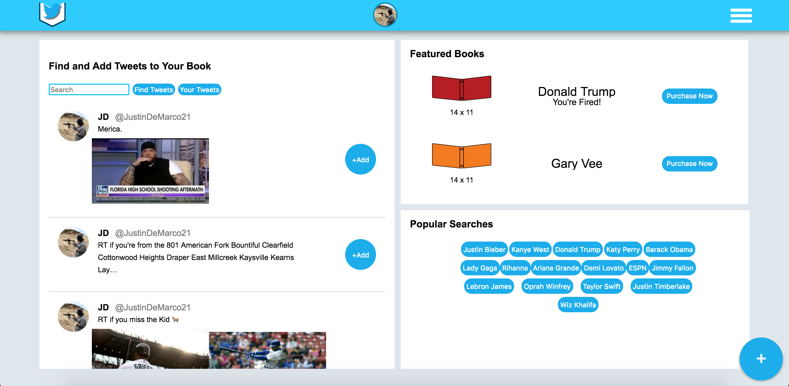
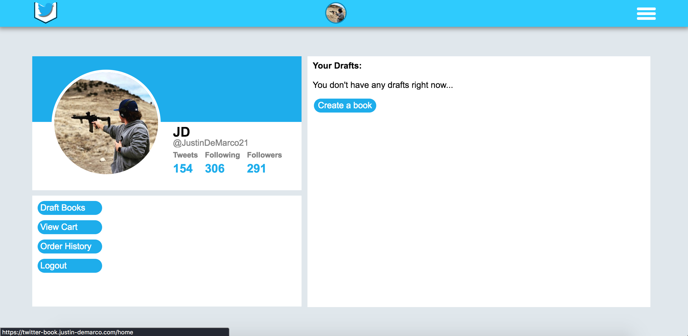
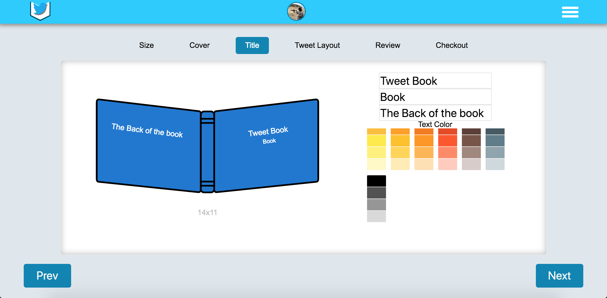

# Twitter Book

## Description

Twitter Book is Twitter Book is a full stack web app that users can create books of their favorite tweets. As well as customize the look and layout of the book.

<a href="https://twitter-book.justin-demarco.com/home">**Live site**</a>  
<a href="https://www.youtube.com/watch?v=NZpiNxxMy1E&t=13s">**Video walktrough**</a>

## Tech used

<ul>
  <li>Built with React, Redux, Node, Express, PostgresQL, Twitter API.</li>
  <li>Used the Twitter API to fetch tweets from the user or searched users. Those tweets then can be added to a book for the user to purchase.</li>
  <li>Postman and Jest was used for testing.</li>
</ul>

## Home view

Home displays featured books, the users tweets and popular searches. The user can search  other users twitter screen names to pull up tweets. Home is where you save tweets to be added to books.

## Profile view

Profie displays the users drafts, cart, order history, and the logout. If there are no drafts the user can redirect to the new book page.

## Step Three view

Step three is adding the title, subtile, and back text. Throughout the steps the book is always updated so if you move to another step it will be where you left off.
